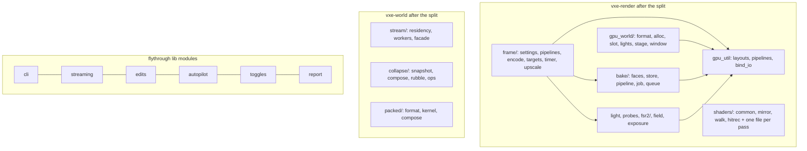

# 0045: The structure pass: split the mega files, share the fixtures, and gate their regrowth

> **Status:** in-progress (approved 2026-10-22), amended 2026-11-10 (review pass), 2026-11-11 (order) and
> 2026-11-12 (the architecture review's notes; Phase 0's drift)
> **Created:** 2026-10-22
> **Amended 2026-11-12 (architect, Phase 0's drift; recommended taken):** the three drift rows
> of `docs/plans/logs/0045.md` (Phase 0, Drift) and its one observation, ruled under the owner's
> standing rule for non-blocking points, with a clear API and maintainability as the weights
> (owner, 2026-11-11/12). **Seams confirmed at `774ca20` with this amendment:** Phase 2 may
> start.
> - **Row 1, `chunk_surface`:** struck from Phase 2's `slot.rs` (Plan 0054 removed it,
>   `2bca6e4`).
> - **Row 2, `build_world`:** it never existed. Phase 7 extracts it from the inline world build
>   in `fn main()` (`main.rs:7136` at `c7072b7`, 253 lines) into `setup.rs`.
> - **Row 3, the narrowing cap:** the in-repo users reach 131 `module::item` paths, 116 of them
>   not at the root (76 + 116 = 192), so 150 cannot hold if every path is re-exported at the
>   root. Taken: **the root is the consumer's API and is capped at 100 names. What else in-repo
>   users reach lives in two named modules that do not count against the cap.** One is
>   `pub mod debug`, documented, for readings. It is the module ADR-0057 names, and Plan 0071's
>   Phase 3 extends it. The other is `#[doc(hidden)] pub mod internals`, which holds the GPU
>   contract and the white-box items. Phase 2 below gives the rule and the number. Rejected:
>   (a) a cap near 200, because it puts some 40 layout bits and 10 shader sources in the
>   consumer's namespace; (b) layout tests as unit tests, because `gpu_mirror` and
>   `gpu_level_mirror` open a device and stay `tests/gpu_*.rs` (`check-test-tiers.mjs`), and
>   the fly-through's `src/` reaches 48 of the paths for its readings anyway; a
>   `test-support`-gated re-export module, because the fly-through binary would need the
>   feature on, and a `pub(crate)` item cannot be re-exported from it without copying it or
>   allowing `unreachable_pub`; (c) keeping 150 by moving users, because the white-box tests
>   would still need the layout items under some path. The `test-support` feature stays what
>   Plan 0044's Phase 8 and Plan 0071's Phase 2 make it: helpers (a device, a world rig), not
>   re-exports. The root's present 76 names stay where they are, WGSL sources included. Moving
>   them, with deprecated re-exports, and pinning the final counts are Plan 0071 Phase 3's job.
> - **The observation:** the Context's sentence about environment variables in production
>   `src/` is corrected (none at `c7072b7`).
> **Amended 2026-11-12 (architect; the review's notes taken as recommended):** from
> `docs/reviews/2026-11-12-architecture-review.md` sections 2.1 (items 1 to 5) and 2.3, and a
> re-read against main at `5909af8` (v0.49.0: Plans 0061 and 0067 closed and merged, Plan 0068
> merged with its owner phase open). Owner order of 2026-11-12: 0067, **0045**, 0070, 0058, the
> rest of 0044 (its Phase 4 struck into 0070), 0069, 0071, 0073.
> - **The seams are re-cut at `5909af8`.** Every "as of" below names it. Phase 3's `bake/` is
>   re-cut for what Plan 0067 added; `fsr2.rs` and the fly-through's `hud.rs` and
>   `showcase.rs` split unconditionally; `gpu_queue.rs` joins the test files over the cap.
>   Phase 0's done-when takes the confirmation from this line when no commit since `5909af8`
>   touches a file Phases 2 to 4 or 7 split; otherwise its drift rows go to the architect.
> - **A premise corrected (review 2.1, item 1).** Plan 0057 removed the screen-space
>   reservoirs, not the emissive estimator: `struct Reservoir`, `merge`, `draw_candidates` and
>   `resolve_emissive` in `light.wgsl` are live, called from the light pass and from
>   `bake.wgsl`. Phase 4 gives them a module, `emissive.wgsl`; Phase 0 names them.
> - **Added:** `fn table()` and `fn now()` to Phase 1 (2.1, item 4); a numeric done-when for
>   Phase 2's narrowing (item 5); `hud.rs` and `showcase.rs` named in Phase 7 (item 2);
>   `gpu_strip.rs`'s reading out of `tests/`, the reading harnesses with more than two switches
>   as examples with flags, the `Steady` shim and `VXE_STEADY` deleted, and a cap on
>   environment variables per test file in `check-test-tiers.mjs` (item 3, section 2.3), all in
>   Phase 8.
> - **Recount at `5909af8`** (`node scripts/loc.mjs` and greps; a snapshot, Phase 0's log
>   supersedes it), against the review's figures at `56008fa`:
>
>   | Figure | Review | `5909af8` |
>   |---|---|---|
>   | `main.rs` / its in-file `mod tests` | 9698 / 2555 lines, 62 tests | 10226 / 2781 lines (7446 on), 67 tests |
>   | `parse_args_from` | 660 lines, 111 flag arms | 689 lines (874-1562), 111 arms, no `--help` |
>   | `Args` / `Run` fields; `impl Run` blocks | 90 / 41; 641 + 1951 | 93 / 41; 663 + 2030 |
>   | `bake.rs` / `marcher.rs` / `gpu_world.rs` / `march.wgsl` | 4642 / 4390 / 3589 / 2496 | 6776 / 4433 / 3643 / 2496 |
>   | `Frame` / `GpuWorld` fields | 75 / 61 | 75 / 62 |
>   | `hud.rs` / `showcase.rs` / `fsr2.rs` (source cap 1200) | 2458 / 1570 / not named | 2477 / 1570 / 1256 |
>   | test files over 2000 | `gpu_bake`, `gpu_mirror`, `settle`, `gpu_look` | the same (3436, 2704, 2342, 2203) and `gpu_queue.rs` 2275 |
>   | `vxe-render` bare `pub` items | 680 (412 fn, 191 const), 13 `pub mod` | 761 (448 fn, 203 const) by `grep -E '^\s*pub (const\|fn\|struct\|enum\|type\|mod\|use)\b'`; 13 `pub mod`; 76 root names |
>   | `fn table()` / `fn now()` copies | 9 / 6 | 9 / 8 (6 in benches, examples, `main.rs`; 2 in `vxe-app` and `vxe-audio` `src/`, kept) |
>   | `VXE_*` names in the fly-through's tests | about 75; `gpu_strip.rs` 40, `gpu_settle.rs` 16 | 69; `gpu_strip.rs` 48, `gpu_settle.rs` 13, `gpu_bake.rs` 6 |
>
> - **Two lanes run: this plan and Plan 0072** (development speed). Shared files and who owns
>   which edit: root `Cargo.toml` (0072 the `[profile.*]` tables, 0045 the
>   `[workspace.lints.clippy]` line); `.github/workflows/ci.yml` (0072 the build, test and
>   clippy steps, 0045 one `check-file-size.mjs` step in the doc-gate block);
>   `CLAUDE.md`'s `scripts/` list (0072 the `test-changed.mjs` row, 0045 a `check-file-size.mjs`
>   row and the `check-test-tiers.mjs` row); `scripts/fixtures/README.md` (a row each);
>   `.claude/skills/orchestrate/references/lane-rules.md` (0072 the gate and setup lines, 0045
>   the strip tool's path). 0045 alone edits `clippy.toml` and `check-test-tiers.mjs`; 0072
>   alone edits `.config/nextest.toml`, `scripts/test-changed.mjs`, the dev skill and
>   `docs/nfr.md` section 7. The lane that merges second takes main and keeps both hunks.
>   Readings: 0072's Phase 1 and 4 and this plan's Phase 0 and close readings each hold the
>   exclusive perf lock with the other lane's builds paused (lane rules).
>
> **Amended 2026-11-11 (owner, the order):** this plan moves ahead of Plan 0058 and of Plan
> 0044's remaining phases (3, 4, 5 and 8; its side lane, Phases 0, 1, 6 and 7, merged to main
> at `d6d2dfa`). It starts once Plans 0061, 0067 and 0068 have merged, while no lane edits a
> file it splits (the order after it is 2026-11-12's, above). What moves with it:
> - **The render device helper is not there yet.** It is Plan 0044's Phase 8, which now runs
>   after this plan. Here the render tests keep their device setup as found and Phase 8's test
>   splits move it unchanged; 0044's Phase 8 lands the helper in the split files.
> - **Fewer plans rewrite the seams first:** Plans 0060, 0061 and 0067 have edited the files;
>   0058 and 0044's render phases have not. Phase 0 still re-measures (its done-when says when
>   the seams count as confirmed).
> **Amended 2026-11-10 (architect, review pass; this header replaces the amendments of
> 2026-11-03 and 2026-11-04; its order, Plans 0060, 0061, 0058, 0044 then this plan, is
> superseded):**
> - **The seams below are provisional** (re-cut at `5909af8` on 2026-11-12, above). Phase 0
>   re-measures at this plan's start commit.
> - **No size or copy count is restated in the body.** The 2026-11-12 recount above is a dated
>   snapshot; the figures that bind live in Phase 0's inventory, in `docs/plans/logs/0045.md`.
> - **This plan does not remove `own`.** Removing the engine's own upscaler deletes tests and
>   goldens, which is a behaviour change. It is another plan's (the backlog carries it);
>   Phase 3 moves `Upscaler` as it finds it.
> - **Gone since the draft, so struck:** the attribute scheduler and `attrib.*` (Plan 0054),
>   `detail.wgsl` (Plan 0055), the screen reservoirs and their unpack (Plan 0057; the emissive
>   estimator's `Reservoir` stays, 2026-11-12 above), the per-face table
>   and its `cache_*` passes (Plan 0059). **New since the draft, so placed:** `bake.rs`,
>   `bake.wgsl`, `light.rs`, `probes.rs`, `fsr2.rs` and `fsr2/`, `field.rs`.
> - **Tests select their tier by marks** (2026-11-10): a GPU test file is `tests/gpu_*.rs`, a
>   long series is `#[ignore = "soak"]`, a hand-run measurement sits in a `mod reading`. No
>   phase edits a filter in `.config/nextest.toml`.
> **Milestone:** cross-cutting (code health)
> **Related ADRs:** none. The splits move code and keep every mechanism. Promoting `FnSource`
> and `SplitMix64` into `vxe-world` adds public items but no decision. The rejected option, a
> separate dev-only `vxe-testkit` crate, is recorded under Decision.
> **Source:** the owner, 2026-10-22, the same review as Plan 0044. The owner's answers: two
> plans, performance first; full splits, engine crates included.
> **After:** Plans 0061, 0067 and 0068 merged (amended 2026-11-11; was 0060, 0061, 0058 and
> 0044). **Beside:** Plan 0072 (2026-11-12 above). **Before:** Plan 0070 (owner, 2026-11-12:
> "70 after 45"), Plan 0058, Plan 0044's Phases 3, 5 and 8, Plan 0069 (render settings),
> Plans 0071 and 0073, and M10.

## TL;DR

The review of 2026-10-22 found a handful of files and types that hold several jobs each, and
the same test fixtures copied from crate to crate. Both have grown since. As of `5909af8` the
mega files are `apps/flythrough/src/main.rs`, and `bake.rs`, `marcher.rs`, `gpu_world.rs` and
`march.wgsl` in `vxe-render`; Phase 0's inventory holds the sizes at the start commit. The
reading harnesses in the fly-through's `tests/` have also grown dozens of environment
switches each; they become tools with flags.

This plan splits each along a named seam and moves the shared fixtures to one home. It then
adds two gates so the files cannot regrow unnoticed: a file-size cap script and clippy's
`too_many_lines`. Behaviour does not change: the goldens stay byte-identical, every pinned
hash stays equal, and the public API changes only where this plan lists it. One thing the
owner will see is that every fly-through toggle shows its mode in the window, under the
owner's standing rule. The modes come out of one table that feeds the HUD, the banner and the
printed line.

## Context & problem

The sizes and copy counts are Phase 0's to read; this section names what is wrong, as of
`5909af8`.

**Mega files and god types:**
- **`apps/flythrough/src/main.rs`** mixes CLI parsing (`Args` and `parse_args_from`), audio,
  streaming pressure policy, autopilot benchmarking, input bindings in several dispatch
  styles, edit-event routing, the bake queue's run state, reports, setup and the frame loop.
  Everything in it is private to the binary, so its tests live inside it. `impl Run` is split
  across two blocks. Plan 0067 added the queue's banner and note rows (`next_missing_light`,
  `next_reach`, `next_budget`, `write_*_note`); Plan 0068 added the camera path, the tour and
  the report flags. A library half already exists (`src/lib.rs` with `castle`, `cave`, `hud`,
  `path`, `report`, `showcase` and `thin_rig`), and `lib.rs` itself holds poses, materials,
  the look presets, the census, replay and `percentile` in one file. `fly.rs` and `pad.rs` are
  private modules of the binary. `apps/tester` depends on the library (`report`'s reader).
- **`vxe-render/src/gpu_world.rs`.** `GpuWorld` holds the window and its pending queue, the
  page and slot allocator, record staging and the belt, light extraction and its range
  allocator, and several per-material `Vec`s. Every `vxe-render` module is `pub mod`, so the
  layout internals are public API.
- **`vxe-render/src/marcher.rs`** holds the settings enums with hand-written
  `name`/`from_name` pairs, the upscaler, the targets, the pipeline and bind-group helpers,
  the pass timer and `Frame`. `Frame` owns every pass's layout and pipeline, the uniforms,
  the bake store and queue, the probe channel, the upscaler state and the exposure, and its
  one `impl` is most of the file. The layout and pipeline helpers are written again in other
  render modules (`fsr2.rs` confirmed; the others are Phase 0's to check). `readback.rs`
  holds three copies of one padded copy-and-depad.
- **`vxe-render/src/bake.rs`** (Plan 0059, grown by Plan 0067) holds the record codecs, the
  CPU face masks, the light summaries and the missing-light chain, the store, the bake
  pipeline and its shader composition, the per-face job state, the job loop, the time budget,
  the step's stage timers and regimes, the queue's order, and the live queue, whose one
  `impl BakeQueue` is about 1900 lines, in one file.
- **`march.wgsl`** holds bindings, mirror decode, DDA traversal, normals, the hit record and
  reprojection, and rand. Each frame pass is `format!("{MARCH_WGSL}\n{source}")`, so
  `sharpen.wgsl`, which needs `params.output_size` only, compiles all of it. Helpers are
  written more than once: the octahedral pair (`march.wgsl`, `probe_gather.wgsl`), the lamp
  cone term (`march.wgsl`, `light.wgsl`, `upscale.wgsl`, `fsr2/input.wgsl`), the edit-box
  test (`temporal.wgsl`, `upscale.wgsl`, `fsr2/input.wgsl`), and the mirror decode
  (`floor_div`, `payload_units`, `pool_word` in `march.wgsl` and `field.wgsl`). The bake
  composes its own source from `march.wgsl` and `light.wgsl` with two text substitutions
  (`bake_source` in `bake.rs`). The emissive estimator (`Reservoir`, `merge`,
  `draw_candidates`, `resolve_emissive`) sits inside `light.wgsl` and is called by the light
  pass and by `bake.wgsl`.
- **`vxe-world`:**
  - `Streamer` mixes residency policy, the worker pool and spill scheduling.
  - `collapse.rs` mixes the snapshot, the composition, rubble and three ops.
  - `packed.rs` mixes format, edit kernel and composition.
  - `edit.rs` carries bench-only reference writers (`Target`, `RowWriter`, `PlanarWriter`)
    and `#[doc(hidden)] pub` `*_decoded` ops in the production module.
  - Several separate count and bound accumulators exist.
  - The chunk clip `[0,1,2].map(|k| (c[k]*e).max(lo[k]))` is written out more than once.
- **`vxe-audio`:** `Mixer::render_block` is one long function with the HRTF-or-pan branch
  copied between voices and buses; `reverb.rs` mixes the FDN and the handover; `acoustics.rs`
  mixes occlusion, reflections, the room fan and cadence.
- **`vxe-net` and `vxe-script-wasm`:** the support-query host in `vxe-net/src/server.rs` is
  copied into `vxe-script-wasm/tests/determinism.rs`.

**Duplicated fixtures** (each kind confirmed present at `5909af8`; Phase 0 counts the copies):

| Fixture | Where |
|---|---|
| closure `WorldSource` | `vxe-audio/tests`, `vxe-render/tests`, `vxe-world/tests/support`, `vxe-sim/tests/support` |
| `SplitMix64` | `vxe-world/tests/support`, `vxe-net/src/test_logic.rs`, `vxe-audio/tests/hrtf.rs`, the fly-through's `gpu_level_mirror.rs`, and inline forms |
| `Fnv1a` and `world_hash` | `vxe-world/tests/support`; duplicate the public `hash::Fnv1a` and `World::voxel_hash` |
| `hash_result` | the fly-through's `determinism.rs` and `replay.rs` (byte-identical bodies) |
| `carved_world` | the fly-through's `tests/support/mod.rs` and `gpu_golden.rs`, which imports the support module |
| `fn table()` (a `MaterialTable`) | `gpu_walk.rs`, `gpu_translucent.rs`, `occlusion.rs`, `vxe-sim/tests/support`, `census.rs`, `brick_kernel.rs`, `edits.rs` (benches), the fly-through's `gpu_bake.rs` and `gpu_queue.rs` (one cave table) |
| `fn now()` | `vxe-world/benches/brick_kernel.rs`, `vxe-net/benches/tick.rs`, `vxe-script-wasm/benches/boundary.rs`, the fly-through's `castle_gen.rs` and `world_budget.rs` examples and `main.rs` |
| bench clocks and `solid_world` | across `vxe-world/benches` |
| world-backed `Host` | `vxe-net/src/server.rs` (`TickHost`), `vxe-script-wasm/tests/determinism.rs` and `benches/boundary.rs` (`WorldHost`) |
| squared chunk distance `d2` | `stream.rs`, `gpu_world.rs` (a function and inline forms), `marcher.rs` |
| a rank statistic | `lib.rs` `percentile`, `report.rs` `nearest_rank`, `main.rs` `median` (the fly-through); `bake.rs` `nearest_rank` (`vxe-render`, its own crate's, kept) |

The wgpu test device helper is Plan 0044's (its Phase 8), which runs after this plan since
2026-11-11; the tests keep their device setup as found here.

**The testbed's protocol and CLI:**
- The dig logic talks to the client in `"op <verb>"` text lines. They are paired with events in
  FIFO order, and a mismatch is dropped silently.
- `examples/hero.rs` has its own lighting-flag parser beside `main.rs`'s.
- `run_headless` copies `vxe-app`'s shell setup and hand-rolls `pollster_block_on`.
- `median` (`main.rs`) and `percentile` (`lib.rs`) use different rank conventions, so F1's
  "median" and the exit line's "p50" disagree; `report.rs` (Plan 0068) added a third.

**The reading harnesses in `tests/`** (review 2.3). `gpu_strip.rs` is a strip tool whose one
reading is narrowed by 48 `VXE_STRIP_*` variables; `gpu_settle.rs` reads 13 names and
`gpu_bake.rs` 6. Their switches are undiscoverable and untested. `VXE_STEADY` drives a
`Steady` shim (`tests/support/settle.rs`) whose names map to the default but for `aN`, a probe
freeze count, for a `--steady` flag the binary has refused since Plan 0057. No production
`src/` file reads an environment variable (`git grep env::var` over `crates/*/src` and
`apps/*/src` finds none at `c7072b7`), so the switches live only in tests.

## Decision

Split along the seams below, keeping every type's behaviour. Promote the fixtures that are
general and deterministic into the engine: `vxe_world::FnSource`, `vxe_world::hash::SplitMix64`
and `ChunkCoord::distance2`. Keep the test-only helpers in per-crate `tests/support` modules
and behind `test-support` features, following `vxe-net`'s `test-logic` precedent (Plan
0044's render device helper follows this plan, 2026-11-11). Narrow `vxe-render`'s public surface to its curated root re-exports, plus a
documented `debug` module of readings and a `#[doc(hidden)]` `internals` module for the GPU
contract (amended 2026-11-12).
Finish with two mechanical gates, because a size rule written in prose is the kind
`CLAUDE.md` says needs a gate.

**One set of caps, and the gates enforce all of it:**

| Cap | Figure | Enforced by |
|---|---|---|
| a `.rs` or `.wgsl` file under `src/` | 1200 lines | `scripts/check-file-size.mjs` |
| a file under `tests/` (its `support/` included), `benches/` or `examples/` | 2000 lines | `scripts/check-file-size.mjs` |
| a function | 150 lines | clippy's `too_many_lines` |

The figures are choices, not measurements. 1200 is the size at which the 2026-10-22 review
began calling a module a mega file (the smallest it named were just over it); 2000 gives a
test file room for its rigs; 150 is clippy's `too_many_lines` set above its default of 100, so
a long `match` passes. No phase states a tighter number of its own.

- We rejected **a dev-only `vxe-testkit` crate**. It adds a workspace member, and features
  plus promotion cover every duplicate except a few cross-crate test statistics, which are
  small enough to copy once into the crate that uses them.
- We rejected **leaving the engine crates alone and splitting only the testbed**. That was the
  owner's call.
- We rejected **a WGSL preprocessor dependency** (naga_oil or similar). `concat!` over
  `include_str!` composes modules with no dependency.

**A reading with more than two switches is a tool, not a test** (2026-11-12): an example of
the fly-through (`apps/flythrough/examples/<name>.rs`) whose flags come from Phase 7's flag
table and print under `--help`. A test file names at most 4 `VXE_*` variables, and
`check-test-tiers.mjs` counts them.
- We rejected **`src/bin` tools**. They build with every `cargo build` of the package and sit
  beside the binaries the tester archive packs; an example builds when asked for or with the
  package's test targets, and ships nowhere.
- We rejected **keeping the harnesses and documenting their variables**. `gpu_strip.rs`
  documents its 48 already; a doc comment does not make a switch tested or discoverable.

## Architecture diagram


```mermaid
flowchart TB
    subgraph render[vxe-render after the split]
        GW[gpu_world/: format, alloc, slot, lights, stage, window]
        MR[frame/: settings, pipelines, encode, targets, timer, upscale]
        BK[bake/: faces, store, pipeline, job, queue]
        LP[light, probes, fsr2/, field, exposure]
        GU[gpu_util: layouts, pipelines, bind_io]
        SH[shaders/: common, mirror, walk, hitrec + one file per pass]
    end
    subgraph world[vxe-world after the split]
        ST[stream/: residency, workers, facade]
        CO[collapse/: snapshot, compose, rubble, ops]
        PK[packed/: format, kernel, compose]
    end
    subgraph fly[flythrough lib modules]
        CLI[cli] --- STR[streaming] --- ED[edits] --- AP[autopilot] --- TG[toggles] --- RP[report]
    end
    MR --> GU
    GW --> GU
    BK --> GU
    LP --> GU
    MR --> BK
    MR --> LP
```

## Implementation phases

Every phase from 1 on does three things:
- reads its files' rows in Phase 0's inventory, and re-reads the files if a commit has landed
  on them since;
- gates on `node scripts/test-changed.mjs --profile quick`, plus `--profile gpu` under the
  perf lock when it touches `vxe-render` or the shaders; the tip gates on
  `cargo nextest run --profile gate`. A golden test marked `#[ignore = "soak"]` that a phase
  claims byte-identical runs by name with `--run-ignored only`;
- proves no behaviour change: goldens byte-identical, pinned hashes equal, bench readings
  within the spread of Phase 0's three runs.

A public item that moves keeps a re-export at its old path unless this plan names its removal.
A test file that opens a GPU device keeps the `gpu_` prefix through every split and rename, a
`#[ignore = "soak"]` mark travels with its test, and a `mod reading` stays a `mod reading` in
the file its tests land in.

**Wall times.** Every new test this plan names is CPU-only and is expected to run in under
1 s (an estimate; nothing here has been run). None renders, so none is a soak candidate.
Existing tests move without change, and their times with them.

### Phase 0: the inventory at the start commit
- **Owner skill:** dev
- **What:** measure, at this plan's start commit, what the phases below cut, and take the
  "before" readings. All of it goes to `docs/plans/logs/0045.md`:
  - **Files:** `wc -l` of every `.rs` and `.wgsl` under `crates/` and `apps/`, with the files
    over each cap of the Decision listed.
  - **Functions:** every function over 150 lines, from one clippy run with
    `too-many-lines-threshold = 150` set locally and not committed.
  - **Types:** the field counts of `GpuWorld`, `Frame`, `Streamer` and the fly-through's `Run`
    and `Args`, and the line span of each `impl`.
  - **Copies:** each fixture of the Context table and each duplicated WGSL helper, by file;
    and where each of the emissive estimator's four items (`Reservoir`, `merge`,
    `draw_candidates`, `resolve_emissive`) is defined and called.
  - **Public surface:** the bare `pub` item count of `vxe-render/src` by the header's grep,
    the root names `lib.rs` exports, and each `vxe_render::<module>::<item>` path used under
    `crates/` and `apps/` (brace-group imports expanded; 131 at `c7072b7`, where the draft's
    single-line grep gave 73). At `5909af8`
    `readback::read_texels_u32` still has no user.
  - **The first consumer:** a grep of `~/Work/voxel-roguelite` for `vxe_render::` module
    paths and for `vxe-world`'s `#[doc(hidden)]` `*_decoded` ops. Each use is listed. (At
    `5909af8` the consumer does not depend on `vxe-render`.)
  - **The reading harnesses:** the distinct `VXE_*` names per file under any `tests/`, and
    the tier counts `N(quick)`, `N(gpu)`, `N(gate)`, `N(soak)`, `N(full)` from
    `cargo nextest list`.
  - **Readings ("before"):** the figures of `## Budgets`, three runs each.
  - **Drift:** each place where a seam below no longer matches the tree, in one line each.
- **Files touched:** `docs/plans/logs/0045.md`.
- **Done when:**
  - The log holds every list above, with the start commit named.
  - Every use the first-consumer grep found is marked "kept as a re-export" in the log, or
    the log says the grep found none.
  - **The seams are confirmed.** If `git log 5909af8..<start> -- <the files Phases 2 to 4 and
    7 split>` is empty and the drift list is empty, the log says "seams confirmed at
    `5909af8` (2026-11-12 amendment)" and Phase 2 may start. Otherwise the architect reads the
    drift and writes, in this plan's header, either "seams confirmed at `<commit>`" or an
    amendment to Phases 2 to 4 and 7; Phase 1 may run meanwhile, Phase 2 waits.

### Phase 1: one home for each shared fixture
- **Owner skill:** dev
- **What:**
  - **New public items in `vxe-world`:** `pub struct FnSource<F>(pub F)` in `source.rs`,
    `pub struct SplitMix64` in `hash.rs` (built on `mix64`), `ChunkCoord::distance2`, and
    `impl FromIterator<Material> for MaterialTable` in `material.rs` (ids in iteration
    order from 1, as `push` gives them).
  - **Copies deleted:** the closure sources, the SplitMix64 streams and every `d2`, as Phase 0
    listed them.
  - **`fn table()`:** each copy that pushes only `Material::named` rows becomes a `collect`
    (`gpu_walk.rs`, `vxe-sim/tests/support`, `brick_kernel.rs`, `edits.rs`); the cave table
    of `gpu_bake.rs` and `gpu_queue.rs` becomes one `cave_table()` in the fly-through's
    `tests/support`. A table whose rows set properties (acoustics in `occlusion.rs`, a
    translucent row in `gpu_translucent.rs`, twenty ids in `census.rs`) stays local with a
    doc line saying what its rows carry.
  - **`fn now()`:** the benches take `vxe-world/benches/support.rs`'s (below); the fly-through
    has one in its library, which `main.rs` and the `castle_gen` and `world_budget` examples
    use, with the clippy allow and its reason once. `vxe-app/src/shell.rs`'s and
    `vxe-audio/src/output.rs`'s are production clock reads of their own crates and stay.
  - **`carved_world`:** `gpu_golden.rs` uses the support module's.
  - **`vxe-world/tests/support`** uses `hash::Fnv1a` and `World::voxel_hash`, or keeps them as
    an oracle with a test asserting equality. Which one it is is stated in its doc comment.
  - **`vxe-audio/tests/support/mod.rs`** (Plan 0044 creates it for its allocator) gains the
    `table`, `world`, `cube` and `ShellCube` fixtures, `tone`, `tail_rms`, `peak`, `energy`,
    and `db_power` / `db_amplitude`. These replace the two different `db`s.
  - **New `vxe-world/benches/support.rs`:** one allowed `now` and `timed`, `solid_world`,
    `box_op` and `slab_cells`. The `vxe-net` and `vxe-script-wasm` benches take a `#[path]`
    copy of the clock.
  - **Fly-through tests:** `hash_result`, the shared op vectors, `dig_inputs` and
    `differing_bytes` move into `apps/flythrough/tests/support`. `assert_golden_exact` joins
    `assert_golden`.
  - **`vxe_net::WorldHost`:** the world-backed `Host` that `TickHost` wraps and that
    `vxe-script-wasm`'s tests and its `boundary` bench use.
- **Files touched:** `crates/vxe-world/src/{source.rs,hash.rs,coords.rs,material.rs,lib.rs,stream.rs}`,
  `crates/vxe-world/{tests,benches}/`, `crates/vxe-audio/{tests,benches}/`,
  `crates/vxe-render/{src/gpu_world.rs,src/marcher.rs,tests}`, `crates/vxe-sim/tests/`,
  `crates/vxe-net/{src,benches}/`, `crates/vxe-script-wasm/{tests,benches}/`,
  `apps/flythrough/{src/lib.rs,src/main.rs,examples,tests}/`.
- **Done when:**
  - Over `crates/` and `apps/`, `struct SplitMix64`, `fn hash_result` and the fly-through's
    `fn carved_world` are each defined in exactly one file (`vxe-world/tests/support`'s
    `carved_world` is its own crate's and stays). A `WorldSource` impl for a closure-backed
    type appears only in `vxe-world/src/source.rs`. `fn unsupported_with_steps` and a
    world-backed `Host` are defined only in `vxe-net/src`.
  - `fn table()` is defined in at most 3 files (9 at `5909af8`), each with its doc line.
  - `fn now()` is defined in exactly 4 files (8 at `5909af8`): `vxe-world/benches/support.rs`,
    the fly-through's library, `vxe-app/src/shell.rs`, `vxe-audio/src/output.rs`.
  - `a_collected_table_numbers_its_rows_from_one` (`vxe-world`'s material unit tests, CPU,
    under 1 s): `["rock", "ore"]` collected gives ids 1 and 2, equal to two `push`es.
  - Every pinned hash and every audio test's expected value is unchanged.
  - `cargo test --doc -p vxe-world` covers a `FnSource` doctest.

### Phase 2: `GpuWorld` becomes a directory of owned parts
- **Owner skill:** dev
- **What (seams as of `5909af8`):** `gpu_world.rs` becomes `gpu_world/`:
  - `format.rs`: the GPU contract constants, `class_code`, `payload_units`,
    `slot_units`, `bin_of`, `ShardLayout` and `budget_for`.
  - `alloc.rs`: a `PoolAlloc` owning the bins (`BinAlloc`), page state and `Fit`.
  - `slot.rs`: `fill_slot`, `materials_of` and `upload_set`. All pure CPU, unit-tested
    without a device. (`chunk_surface` is struck: Plan 0054 removed it, `2bca6e4`.)
  - `lights.rs`: a `LightMirror` owning `LightSample`, `ChunkLights` and the `light_*` fields.
  - `stage.rs`: an `Uploader` with `Band`, the `Belt` and the `flush_*` functions.
  - `window.rs`: a `WindowQueue`.
  - `mod.rs`: `GpuWorld` as the composition.

  Two smaller changes go with the split:
  - A `MaterialFlags` struct replaces the per-material `Vec`s.
  - The `lod: bool` parameters become `Bricks::is_lod()`.

  `vxe-render`'s modules become private behind the existing curated `pub use` list, and
  layout items become `pub(crate)`. Each item an in-repo user reaches by a module path (the
  131 of Phase 0's list) gets exactly one public home, chosen by this rule (amended
  2026-11-12):
  - **The root** takes an item a consumer needs to configure or drive the renderer: a type a
    public method of `GpuWorld`, `Frame`, `Presenter` or `BakeQueue` takes or returns, the
    type of a public field of a settings struct, or the default value of a setting. At Phase 0
    that covers, for example, `Budget`, `MissingLight`, `ReachMode`, `QueueOrder` and its
    `Refine`, `Upscaler`, `Params`, `queue_settings` and the `DEFAULT_*` constants of the bake,
    the mirror, the lights and the probes.
  - **`pub mod debug`** (documented) takes readings: the `readback` functions and
    `StepHistogram`, the queue step's `StepStages`, `STEP_STAGES`, `Regime` and `StepTally`,
    and the light summaries a getter returns. ADR-0057 names this module, and Plan 0071's
    Phase 3 moves the texture getters and timers into it.
  - **`#[doc(hidden)] pub mod internals`** takes the rest: the GPU contract constants and
    layout functions (`gpu_world/format.rs`'s bits, words and bins, `bin_of`,
    `slots_per_page`, `budget_for`, the field's band units, the bake's record and view
    constants), the WGSL sources and composers that are not already root names (`fsr2`'s
    passes, `composite_hdr_source`), and pure white-box functions a test asserts against
    (`face_classes`, `view_half_angle(s)`, `TestProbe`, `FONT`). Its doc line says it is not
    API and carries no semver promise. The fly-through's readings and the layout tests reach
    it by `vxe_render::internals::…`.

  `debug` and `internals` are each a `pub use` list over the private modules: no item is
  defined in them, so each item keeps one definition and `unreachable_pub` still bites.
  `vxe-render`'s `lib.rs` sets `#![deny(unreachable_pub)]`, so a bare `pub` that the root
  does not reach is a compile error rather than an intent. `readback::read_texels_u32` is
  deleted if Phase 0 still finds no user. `OPAQUE_WORDS` (used inside `gpu_world`) becomes
  `pub(crate)`. `GpuWorld::free_pages()` stays public: the fly-through prints its length, and
  the mirror tests read it.
- **Files touched:** `crates/vxe-render/src/{gpu_world/,gpu_world.rs,lib.rs,readback.rs,marcher.rs,bake.rs,fsr2.rs,light.rs,probes.rs,field.rs,exposure.rs,hud.rs,present.rs,camera.rs,font8x8.rs}`
  (visibility only outside `gpu_world/`), `crates/vxe-render/tests/`,
  `apps/flythrough/{src,tests,examples}/` (imports only), `apps/tester/src/` (imports only, if
  any).
- **Done when:**
  - `GpuWorld` has at most 15 fields, each a part or a scalar.
  - **The narrowing is a number and a rule (amended 2026-11-12).** `vxe-render`'s `lib.rs`
    declares exactly two `pub mod`s, `debug` and the `#[doc(hidden)]` `internals` (13 at
    `5909af8`), and each is a `pub use` list that defines no item. The crate root exports at
    most 100 names: the 76 at `5909af8` plus at most 24 promoted under the root rule above
    (`debug` and `internals` do not count). The log lists each of Phase 0's 131 module paths
    with its new home (root, `debug` or `internals`) and the rule clause that put it there.
    No in-repo user reaches an item through any other module path. `cargo clippy -p
    vxe-render` passes with `unreachable_pub` denied, and the log states the header's
    bare-`pub` grep count before (761 at `5909af8`) and after.
  - `node scripts/check-file-size.mjs crates/vxe-render/src/gpu_world` would pass: no file in
    `gpu_world/` is over the source cap. (The script lands in Phase 8; until then `wc -l`.)
  - Every mirror test passes unchanged, and slot words are byte-identical to the phase's start
    commit.
  - Every golden is byte-identical.
  - The public items removed from `vxe-render` are listed in the log's close triggers, and
    every in-repo user and every first-consumer use from Phase 0 compiles against the curated
    surface.

### Phase 3: `marcher.rs`, `bake.rs` and `fsr2.rs` become directories
- **Owner skill:** dev
- **What (seams as of `5909af8`, after Plans 0060, 0061 and 0067; Plans 0070 and 0058 edit
  the split files after this plan):**
  - **`marcher.rs` becomes `frame/`:**
    - `settings.rs`: `Params`, the enums and flags, `Lighting`, `LookParams`, `LodParams`.
      A `macro_rules!` generates `ALL`, `name` and `from_name`; `light.rs` and `bake/` use
      it for their pairs too.
    - `targets.rs`: `Targets`. `timer.rs`: `PassTimer`. `readback_ring.rs`: `ReadbackRing`,
      `RingSlot`, `RingState`. `marcher.rs` keeps `Marcher`, the hit pass, alone.
    - `upscale.rs`: `Upscaler`, `halton`, `jitter_at`, and an `UpscaleState` that owns the
      upscaler's uniforms, the sharpen parameters, the history, the jitter, the kind and the
      FSR 2 handle.
    - `pipelines.rs`: a `Pipelines` struct that owns every pass's layout and pipeline, built
      from a `const PASSES: [PassSpec; N]` table instead of the hand-written pairs in
      `Frame::with_sizes`.
    - `state.rs`: a `FrameState` that owns the uniforms and what they are built from (the
      params and edits buffers, the look, the LOD, the lighting, the `Lamp`, the emission
      scale, the blue noise, the frame counter, the `LightKey` and `LampKey` change keys).
      `History` goes with the part that reads it (Phase 0 names which).
    - `baked.rs`: a `BakeLink` that owns the store, the bake pipeline, the dig boxes and the
      bake queue, with `Frame`'s bake methods.
    - `probe_channel.rs`: a `ProbeChannel` that owns the probe volume, its layouts and
      pipelines and its counters, with `Frame`'s probe methods.
    - `encode.rs`: `encode_with` split into `write_uniforms`, `bind_groups` and `record`,
      with `Dispatch`. Its `keep_history: bool` becomes an enum.
    - `mod.rs`: `Frame` as the composition (the device, the targets, the output, the
      exposure and the parts above) and its public setters.
  - **`bake.rs` becomes `bake/`** (re-cut at `5909af8` for Plan 0067's additions):
    - `record.rs`: the record words and their codecs (`tone_level`, `se_levels`,
      `rgb9e5_*`, `record_words`, the store and brick constants and flags). Pure CPU.
    - `faces.rs`: the face classes, `ChunkFaces`, `ChunkMasks`, `FacePrep`, `PreparedMasks`
      and the `list_*` functions. Pure CPU.
    - `summary.rs`: `MissingLight`, `ReachMode`, `RecordMean`, `block_summary`,
      `mean_record`, `ParentTable`, `LightSummaries`, the provisional and fallback blocks and
      `fade_mix` (Plan 0067's missing-light chain). Pure CPU.
    - `store.rs`: `Store`, `StoreStats` and the placement allocator.
    - `pipeline.rs`: `BakeSettings`, `BakePipeline`, `bake_source`, `replace_once` and
      `job_table`.
    - `job.rs`: `FaceState`, `BakeRun`, `Job`, `run`, `rebake`, `dig_ring`, `DigReport`.
    - `job_loop.rs`: `JobLoop`, `InFlight`, `LoopTimer`, `SubmitRoom`, `OpenJob`, `JobCtx`.
    - `budget.rs`: `Budget` and the slice constants. `stages.rs`: `StepStages`, `Laps`,
      `Regime`, `StepTally`.
    - `order.rs`: `QueueOrder`, `Refine`, the candidate heap and the view-angle and score
      functions. Pure CPU.
    - `queue/`: `BakeQueue` and `QueueView`, `QueueStats` in `mod.rs`; its one `impl` split
      into one file per group of step stages (the `S_*` stage names are the seams: window and
      reach, digs and withdrawal, candidates and checks, poll, collect, place and submit,
      fades and summaries), each under the cap.
    - `mod.rs`: `BakeReport`, `BakeProgress`, `BakeError`, `FaceOutcome` and the re-exports.
    - The in-file `mod tests` (about 600 lines) goes to the modules it tests.
  - **`fsr2.rs` becomes `fsr2/`** along its own sections (settings and tuning, the pipelines,
    the per-frame `prepare`); it is over the source cap at `5909af8`.
  - **`gpu_util.rs`** takes the layout, bind-group and pipeline helpers. `frame/`, `bake/`,
    `fsr2/`, `field.rs`, `exposure.rs`, `probes.rs`, `hud.rs` and `present.rs` use it.
    `light.rs` and `probes.rs` stay single files.
  - **`readback.rs`'s three copies** become one `read_texels` and thin wrappers.
- **Files touched:** `crates/vxe-render/src/{frame/,bake/,fsr2/,gpu_util.rs,marcher.rs,bake.rs,fsr2.rs,light.rs,probes.rs,field.rs,exposure.rs,hud.rs,present.rs,readback.rs,lib.rs}`,
  `crates/vxe-render/src/shaders/fsr2/` (only if a pass's `include_str!` path moves).
- **Done when:**
  - `Frame` has at most 20 fields, each a part or a scalar.
  - No file under `frame/`, `bake/` or `fsr2/` is over the source cap, and no function in
    them is over 150 lines (the clippy run of Phase 0, repeated).
  - `readback.rs` has one `copy_texture_to_buffer` call.
  - Every golden is byte-identical, and `gpu_bake.rs`'s and `gpu_queue.rs`'s tests pass
    unchanged.
  - The CPU `encode` time and the queue step's p50 are within the spread of Phase 0's
    readings.

### Phase 4: the shaders become modules a pass picks
- **Owner skill:** dev
- **What (seams as of `5909af8`):** `march.wgsl` splits into four modules:
  - `common.wgsl`: Params, View, flags, luminance, hash and rand.
  - `mirror.wgsl`: the layout constants and pure decode over words.
  - `walk.wgsl`: the walk, `descend`, `lookup` and the DDA, with `enter_window` and
    `exit_cell` extracted.
  - `hitrec.wgsl`: the octahedral encoding, the hit record and reprojection.

  And `light.wgsl` gives up a fifth: `emissive.wgsl`, the emissive estimator (`Reservoir`,
  `merge`, `Candidate`, `candidate` and the helpers only it calls, `draw_candidates`,
  `resolve_emissive`), composed after `walk.wgsl` by the light pass and by the bake. Its
  names stay as they are (a rename is not a structure move); it is not the screen reservoirs
  Plan 0057 removed.

  Each pass is composed with `concat!(include_str!(…), …)` of only what it uses. Each helper
  Phase 0 found in more than one file collapses to one definition: the octahedral pair, the
  lamp term, the edit-box test, the mirror decode, and any "same surface" test, which takes
  its threshold as a parameter so each caller passes its current constant and no output
  changes.

  `field.wgsl` uses `mirror.wgsl` instead of its own decode, and `fsr2/`'s passes that prepend
  `march.wgsl` take only what they use. **The bake** (`bake.wgsl`) composes after the walk
  and `light.wgsl` with two text substitutions; each substituted line stays in exactly one
  module, and `bake_source` names that module. The bit constants come from a WGSL prelude that
  Rust generates from the `gpu_world/format.rs` and `frame/settings.rs` consts. Plan 0044's
  layout test keeps guarding the structs.
- **Files touched:** `crates/vxe-render/src/shaders/` (`emissive.wgsl` new; `light.wgsl`,
  `bake.wgsl`, `fsr2/`), `crates/vxe-render/src/{frame/,bake/pipeline.rs,field.rs,fsr2/,probes.rs,exposure.rs,gpu_world/format.rs,lib.rs}`,
  `crates/vxe-render/tests/{gpu_shader_portability.rs,gpu_mirror.rs}` (the composed sources
  they read only).
- **Done when:**
  - Every golden is byte-identical.
  - A baked chunk's store bytes are equal before and after the phase
    (`gpu_bake.rs`'s tests unchanged). If a `--bake-file` store is keyed on the bake's shader
    source, the log says that saved stores re-bake once (not verified at the draft).
  - `the_composed_sharpen_and_present_sources_hold_no_walk`, a unit test over the composed
    strings in `vxe-render/src`, finds no `fn descend` in either.
  - `the_emissive_estimator_is_defined_once`: `fn draw_candidates` and `struct Reservoir`
    occur only in `emissive.wgsl`, and the light pass's and the bake's composed sources each
    hold them exactly once (part of the scan below).
  - `no_wgsl_function_is_defined_in_two_shader_files`, a unit test that scans
    `src/shaders/`, passes.
  - `gpu_shader_portability.rs` validates every composed pass, the bake's included, from one
    list that the `PASSES` table and `bake_source` generate, not from a hand list.
  - No bit constant that Rust defines is written as a literal in WGSL. This is checked by the
    layout test.
  - The hit, light and post pass times are read on both adapters and are within the spread of
    Phase 0's readings.

### Phase 5: the world crate's three big modules split
- **Owner skill:** dev
- **What:**
  - **`stream.rs`** becomes `stream/`: `residency.rs`, a pure `ResidencyPlan` unit-tested
    without threads; `workers.rs`, the pool and loaders; and a thin `Streamer` facade. `apply`
    splits into `absorb_done`, `commit_residency` and `schedule_io`. The `oracle` sits behind
    `cfg(any(test, feature = "stream-oracle"))`.
  - **`collapse.rs`** becomes `collapse/`: `snapshot.rs`, `compose.rs`, `rubble.rs` and the
    ops. `drop_region_with` splits into gap scan, crush and move.
  - **`packed.rs`** becomes `packed/`: `format.rs`, `kernel.rs` and `compose.rs`.
  - **The bench-only reference writers and the `*_decoded` ops** move behind a
    `bench-internals` feature. The Uniform fast path uses `kernel_mode().target`.
  - **One `Tally`** replaces the count and bound accumulators Phase 0 listed.
  - **New helpers:** `coords::clip_box` and `coords::local_of_index`, plus a `wire::Writer`
    that mirrors `Reader`.
- **Files touched:** `crates/vxe-world/src/`, `crates/vxe-world/{Cargo.toml,benches,tests}/`.
- **Done when:**
  - Every pinned hash, wire round trip and replay test is unchanged.
  - `World`'s public API without the feature loses only the `#[doc(hidden)]` items, and they
    are listed in the log; a first-consumer use from Phase 0 keeps its item public.
  - The chunk-clip expression appears only in `coords.rs`.
  - The edit and collapse benches are within the spread of Phase 0's readings.

### Phase 6: audio, net, wasm and assets split their long functions
- **Owner skill:** dev
- **What:**
  - **`Mixer::render_block`** splits into `write_echo`, `advance_direct_delay`,
    `render_direct`, `lowpass` and `reap_finished`.
  - **A `Spatialiser`** serves both voices and buses.
  - **`reverb.rs`** becomes `reverb/{network.rs,handover.rs}`.
  - **`acoustics.rs`** becomes `occlusion.rs`, `reflections.rs` and `room.rs` under an
    `Acoustics` scheduler. One `fibonacci_sphere::<N>()` replaces the two direction tables.
  - **The `#[doc(hidden)]` audio test hooks** move behind a `test-hooks` feature.
  - **`VoxFile::parse`** splits per chunk kind, and its graph walk is cached for
    `placements`.
  - **`add_host`** becomes one function per import.
  - **`Output::open` and `Input::open`** share `format_error`.
- **Files touched:** `crates/vxe-audio/src/`, `crates/vxe-audio/{Cargo.toml,tests}/`,
  `crates/vxe-assets/src/vox.rs`, `crates/vxe-script-wasm/src/host.rs`.
- **Done when:**
  - The mixer and reverb tests produce the same samples.
  - The no-allocation and no-free tests from Plan 0044 still read 0.
  - No function in these crates' `src/` is over 150 lines.
  - The mixer bench is within the spread of Phase 0's reading.

### Phase 7: the testbed's library takes the binary's contents
- **Owner skill:** dev
- **What (seams as of `5909af8`):** `apps/flythrough/src/lib.rs` already exports `castle`,
  `cave`, `hud`, `path`, `report`, `showcase` and `thin_rig`. This phase moves `main.rs` into
  that library and splits what is over the cap in it.
  - **`main.rs`'s contents become lib modules:**
    - `cli.rs`: `Args` grouped into `AudioArgs`, `LightingArgs`, `LookArgs`, `BakeArgs` and a
      `RunMode` enum; one flag table; shared on/off and enum helpers; and a `--help`
      generated from the table. `examples/hero.rs` uses the table too.
    - `streaming.rs`: `RadiusRule`, `Deferrals`, `Stream`, with one `stats()` read per frame.
    - `edits.rs`: `Net`, `BenchSum`, event routing.
    - `autopilot.rs`: `Autopilot`, `Leg`, `NearRing`, `SettleClock`.
    - `audio.rs`: `Audio`, `Mix`, `Mic`, `RoomProbe`.
    - `setup.rs`: `Gfx`, and a new `build_world` (amended 2026-11-12: there is no such
      function at `c7072b7`). It is extracted from the world build written inline in
      `fn main()` (`main.rs:7136`, 253 lines) and split so that no function is over 150 lines.
      `main` keeps the parse, the call and the run.
    - `toggles.rs`: one table of key, name, getter and flip over `hud::Modes`, which owns no
      GPU object. It feeds the HUD rows, the banner and the printed line. Plan 0067's
      missing-light, reach and budget cycles (`next_*`) are rows of it; their `write_*_note`
      and banner rows go to `hud_feed.rs`.
    - `run/`: `Run` in one `impl` per file: `mod.rs` (the struct and its construction),
      `frame.rs` (the per-frame update), `keys.rs` (key dispatch through the toggle table),
      `queue.rs` (`QueueRun`, `DigWatch`, `queue_step_line`, the queue view lines),
      `hud_feed.rs` (the HUD's rows and samples), `tour.rs` (Plan 0068's path, tour and
      tester-mode state, if `path.rs` does not already hold it).
    - `app.rs`: `Flythrough` and its `App` impl.
  - **`fly.rs` and `pad.rs`** become modules of the library, unchanged.
  - **`lib.rs`'s own contents** move to `scene.rs` (poses, cameras, material tables),
    `look.rs` (`LookPreset`), `census.rs` and `replay.rs`. `report.rs` (Plan 0068's) keeps its
    `nearest_rank` as the one rank statistic: `lib.rs`'s `percentile` becomes a re-export or
    a thin call of it, and `main.rs`'s `median` is deleted for it, with one procfs reader
    (`peak_rss_bytes`) and capped per-frame series. `lib.rs` keeps the module list and
    re-exports every item at its present path, so `apps/tester` compiles unchanged.
  - **`hud.rs` and `showcase.rs` become directories** along their sections (both are over
    the source cap at `5909af8`; Phase 0 names the sections), each file under the cap.
  - **A typed `DigEvent`** with `encode`/`decode` and the op index replaces the `"op <verb>"`
    text lines and their FIFO pairing.
  - **`vxe_app::run_headless(app, HeadlessConfig)`** replaces the testbed's copy and its
    hand-rolled `pollster_block_on`.
  - **The in-binary tests** move to `tests/` or into the lib modules they test. One that
    opens a device lands in a `tests/gpu_*.rs` file.
  - **The refusals of removed flags** (`gone_since_0059` and the other removed-flag arms)
    are table rows marked refused, so `--help` does not list them and the parser still
    names the plan that removed each.
- **Files touched:** `apps/flythrough/src/` (`hud/`, `showcase/`, `run/` and the modules
  above new; `main.rs`, `lib.rs`, `hud.rs`, `showcase.rs`, `report.rs`, `fly.rs`, `pad.rs`
  moved or edited), `apps/flythrough/logic/src/lib.rs`, `apps/flythrough/{examples,tests}/`,
  `apps/tester/src/` (imports only, if a path changes), `crates/vxe-app/src/{shell.rs,lib.rs}`.
- **Done when:**
  - `main.rs` is under 200 lines, and no file under `apps/flythrough/src/` is over the source
    cap, `hud/` and `showcase/` included.
  - The test count is unchanged: `cargo nextest list -p flythrough` gives the same
    `N(gate)` and `N(full)` before and after the phase (67 in-binary tests at `5909af8` among
    them, now under new paths).
  - Every key the testbed binds is in the toggle table, or is listed in the log as a one-shot
    action with no mode.
  - `every_toggle_shows_its_mode_in_the_hud_grid` (`apps/flythrough/tests/toggles.rs`, CPU,
    no device) flips each table toggle once and asserts that the HUD's text grid shows the
    new mode in the row the table names. That includes `off` for the cutaway and the shadow
    ray, and the dig radius.
  - `an_event_with_no_matching_op_is_an_error` (the logic's unit tests): a logic event whose
    op index matches no applied op is a test-visible error, not a silent `continue`.
  - `help_lists_every_flag_the_parser_accepts` (`cli.rs`'s unit tests) diffs the flags in
    `--help` against the table the parser reads.
  - `the_median_and_the_p50_agree` (`report.rs`'s unit tests): one series gives one value on
    both the F1 line and the exit line.
  - The replay, determinism and component tests give equal bytes.
  - The fly-through's frame goldens are byte-identical. The HUD goldens
    (`tests/gpu_hud_golden.rs`) change only by the new mode rows. They are re-blessed on
    lavapipe, and the change is shown to the owner in Phase 9.

### Phase 8: the mega test files split, and two gates keep everything small
- **Owner skill:** dev
- **What:**
  - **`vxe-render/tests/gpu_mirror.rs`** splits into `gpu_mirror_alloc.rs`,
    `gpu_mirror_tiers.rs` and `gpu_mirror_budget.rs`.
  - **Any other file over the test cap** in Phase 0's list splits along its sections, a
    `tests/support/` file included. As of `5909af8` that names the fly-through's
    `tests/support/settle.rs`, `tests/gpu_bake.rs`, `tests/gpu_queue.rs` and
    `tests/gpu_look.rs`.
  - **Any source file still over the source cap** after Phases 2 to 7 splits along its
    sections too.
  - **The reading harnesses become examples** (Decision). `gpu_strip.rs`'s reading becomes
    `apps/flythrough/examples/strip.rs`, its `VXE_STRIP_*` switches flags of Phase 7's
    table with `--help`; its five gate tests stay in `tests/gpu_strip.rs`. Each other `mod
    reading` that reads more than two switches of its own (at `5909af8`: `gpu_settle.rs`'s
    and `gpu_bake.rs`'s; Phase 0's count decides) becomes an example the same way. The
    helpers an example shares with the tests live in one `tests/support/` file the example
    takes by `#[path]`, not in the library the tester archive ships. A reading with at most
    two switches stays a `mod reading`.
  - **The `Steady` shim goes:** `Steady` in `tests/support/settle.rs`, `VXE_STEADY` in
    `gpu_settle.rs`, and the strip's `VXE_STRIP_STEADY` and `VXE_STRIP_SAMPLER` refusals. The
    probe freeze count it carried (`aN`) becomes the settle example's `--probe-freeze N` flag,
    if that reading survives the move.
  - **`scripts/check-test-tiers.mjs` gains a cap:** a file under any crate's `tests/` (its
    `support/` included) names at most 4 distinct `VXE_*` environment variables, counted as
    string literals, so a wrapper (`env`, `env_or`, `on_off`, `list`) does not hide one.
    `VXE_BLESS`, `VXE_REQUIRE_SOFTWARE_ADAPTER` and `VXE_TEST_ADAPTER` count. A seeded
    fixture holds one file at 5 (a finding) and one at 4 (passes).
  - **`scripts/check-file-size.mjs`** enforces the two file caps of the Decision. It has an
    optional `root` argument and a seeded fixture tree, like the other gates, and joins CI.
  - **`clippy.toml`** sets `too-many-lines-threshold = 150`, and `[workspace.lints.clippy]`
    denies `too_many_lines`. A test function still over 150 lines carries
    `#[expect(clippy::too_many_lines, reason = "...")]`, and the close lists each one.
  - **Tiers.** No profile lists a test, so `.config/nextest.toml` is not edited. Each new
    file that opens a device is named `gpu_*.rs`; each moved soak test keeps its
    `#[ignore = "soak"]`; each moved reading stays in a `mod reading`.
- **Files touched:** `crates/vxe-render/tests/`, `apps/flythrough/tests/` (`gpu_strip.rs`,
  `gpu_settle.rs`, `gpu_bake.rs`, `gpu_queue.rs`, `gpu_look.rs`, `support/settle.rs` and the
  files they split into), `apps/flythrough/examples/` (`strip.rs` and the other readings,
  new), `apps/flythrough/Cargo.toml` (an `[[example]]` entry each, if needed), any file over
  a cap, `scripts/check-file-size.mjs`, `scripts/fixtures/file-size/`,
  `scripts/check-test-tiers.mjs`, `scripts/fixtures/test-tiers/` (the env-name case),
  `scripts/fixtures/README.md` (two rows), `clippy.toml`, `Cargo.toml` (the
  `[workspace.lints.clippy]` line only), `.github/workflows/ci.yml` (one step),
  `CLAUDE.md` (the `scripts/` list's two rows), `.claude/skills/orchestrate/references/lane-rules.md`
  (the strip tool's path, one line).
- **Done when:**
  - `node scripts/check-file-size.mjs` exits 0 on the tree. On its fixture it exits 1 with
    exactly the findings its README row names: one source file over, one test file over, one
    `tests/support/` file over, and one file exactly at the cap that passes.
  - `cargo clippy --workspace --all-targets -- -D warnings` exits 0 with the lint denied, and
    no `src/` function carries the `expect`. Test functions may carry it, and they are listed.
  - `node scripts/check-test-tiers.mjs` exits 0 on the tree, and on its fixture names
    exactly the 5-variable file. No `VXE_STEADY` or `struct Steady` remains under `apps/` or
    `crates/`.
  - Each new example parses its flags through Phase 7's table helpers, so its `--help` and
    its parser read one table (what `help_lists_every_flag_the_parser_accepts` defends);
    `cargo run -p flythrough --example strip -- --help` is run once and its output is in the
    log.
  - The tier partition holds, read with `cargo nextest list` before and after the phase:
    `N(quick) + N(gpu) = N(gate)`; `N(gate) + N(soak)` (`--profile soak --run-ignored only`)
    `= N(full)` (`--profile full --run-ignored all`); `N(quick)`, `N(gpu)`, `N(gate)` and
    `N(soak)` are equal before and after; `N(full)` falls by exactly the readings that became
    examples, each named in the log.

### Phase 9: the owner reads every toggle on screen
- **Owner skill:** human
- **What:** the owner flies `flythrough` and presses every key in the toggle table once, with
  stdout visible. `dev` prepares the run script and sends a push notification when it is ready.
- **Done when:** the owner confirms that each toggle's mode shows in the window as it changes,
  and that the frame looks as it did before the plan. Anything they reject is a line in
  `### Notes` and goes back to `dev`.

## Data shapes

```rust
// illustrative
pub struct FnSource<F>(pub F);
impl<F: Fn([i32; 3]) -> MaterialId + Sync> WorldSource for FnSource<F> { /* … */ }

struct PassSpec { label: &'static str, modules: &'static [&'static str], entry: &'static str, io: &'static [Io] }

struct Toggle { key: Key, name: &'static str, row: HudRow, get: fn(&Modes) -> &'static str, flip: fn(&mut Modes) }
```

## Budgets

No `docs/nfr.md` figure should move. Phase 0 takes the "before" at this plan's start commit
and the close takes the "after", three runs each, under the perf lock and labelled with the
load. The GPU figures are read on both adapters of `docs/nfr.md` section 1: the dev reference
(RTX 3080 Laptop) and the slow adapter (the Cezanne iGPU on RADV).

| Figure | `docs/nfr.md` | How it is read |
|---|---|---|
| frame time and per-pass times at the fly-through's defaults | section 2 (readings in `docs/nfr/02-frame-budget.md`) | the autopilot's headless run, both adapters |
| `sync` p50 and p99 at `r_full` 16 | section 2, the streaming and upload line | the same run |
| the bake queue's step p50 | section 2 | the same run |
| edit and collapse benches | section 4 | `cargo bench -p vxe-world`, CPU |
| mixer bench | section 9 | `cargo bench -p vxe-audio`, CPU |
| clean `cargo build`, and a rebuild after touching `vxe-world/src/lib.rs` | section 7 | wall time, dev reference |

A reading outside the spread of its three "before" runs is a finding, not noise. The build
times are read because module splits can change them. The comparison is against this plan's
own start commit, not against Plan 0044's close: other commits may land between the two.

## Risks & open questions

- **The seams may be stale at the start.** They were re-cut at `5909af8`, after Plans 0060,
  0061 and 0067 and Plan 0068's code. Phase 0's drift list and the architect's confirmation
  exist for anything that lands after; `dev` does not re-cut a seam alone.
- **Size of the diff.** Phases 2 to 7 move thousands of lines. A move commit is kept apart from
  a change commit within a phase where `git` would otherwise lose the history (`git mv`, then
  edit), so the reviewer can diff moves with `--color-moved`.
- **Public API.** Phase 2 narrows `vxe-render`, and Phase 5 hides `World`'s reference ops.
  Phase 0 greps the first consumer (`~/Work/voxel-roguelite`), and Phases 2 and 5 keep each
  use it found as a re-export.
- **The lane beside Plan 0072** (header, 2026-11-12). Its profile change (Phase 2) moves the
  build times this plan reads under `## Budgets`. If this lane merges main after 0072's
  Phase 2 has landed there, it re-takes the build "before" on the merged base, so both sides
  of the comparison share the profiles.
- **Shader composition.** `concat!` of shared modules means a module's identifiers are global to
  every pass that includes it. Name clashes surface as naga errors at pipeline build, which the
  existing validation tests catch headlessly. The bake's text substitutions fail loudly if
  their target line moves (`replace_once`).
- **Determinism.** Phase 5's `Tally` and `Writer` touch result and wire bytes. The pinned hashes
  and the round-trip tests guard them, and a change is a stop.

## What this plan does NOT do

- **Change behaviour, defaults or the look.** The one visible change is toggles reaching the
  window, under the owner's standing rule.
- **Remove `own`, the engine's own upscaler.** FSR 2 is the default (Plan 0056), and the
  removal deletes tests and goldens. It is its own plan (`docs/backlog.md`); here `Upscaler`
  moves to `frame/upscale.rs` unchanged.
- **Move the residency pressure rule into an engine crate.** That is Plan 0044's followup 3.
- **Move the fly-through's render tests into `vxe-render`.** They need the cave scene builders.
  A shared scene crate is a followup if the owner wants the renderer testable alone.
- **Add a `vxe-testkit` crate** (rejected above).
- **Rename the emissive estimator's `Reservoir`, or fix the stale "reservoir", "contour" and
  "emissive table" comments.** The rename is not a move; the comments are the backlog's
  comment-and-manifest chore (review 2.4).
- **Edit `.config/nextest.toml`, `scripts/test-changed.mjs` or the build profiles.** They are
  Plan 0072's.

## Owner answers

1. **The order (owner, 2026-11-03).** "the main thing that I care about for now is a stable image without any flicker or aliasing artiacts. we move towards this image by any means possible, considering performance of course. all other things doesnt really matter as of now, so just go with recommended"
2. **The order, restated (owner, 2026-11-10).** The drafts first: Plans 0060, 0061, 0058, then
   Plan 0044, then this plan, re-cut against the tree at its start.
3. **`own` (owner, 2026-11-10).** Its removal is its own small plan; this plan stays a pure
   structure move.
4. **The order, amended (owner, 2026-11-11).** This plan moves ahead of Plan 0058 and the rest
   of Plan 0044. It starts once Plans 0061, 0067 and 0068 have merged, while no lane edits the
   files it splits. Plan 0069 stays after it. This replaces answer 2's order.
5. **The order and the review's notes (owner, 2026-11-12).** Order 0067, 0045, 0070, 0058,
   the rest of 0044 (its Phase 4 struck into 0070), 0069, 0071, 0073; Plan 0072 runs beside
   this plan. The review's amendment notes for this plan are taken as recommended under the
   owner's standing rule for non-blocking questions (header, 2026-11-12).

## Implementation log

| phase | owner | state | commit |
|---|---|---|---|
| 0: the inventory at the start commit | dev | inventory done, "before" readings owed (scheduled by the orchestrator); drift (3 rows) ruled at `70793b6`; [`logs/0045.md`](logs/0045.md) | `22df5d4` |
| 1: one home for each shared fixture | dev | done; bench fixtures at `benches/support/`; five same-named audio helpers stay local; deviations in the log | `1d5b932` |
| 2: `GpuWorld` becomes a directory of owned parts | dev | done; 11 fields; root 100 names, `debug` 15, `internals` 95; 13 items past Phase 0's 131 paths housed; `opaque_table`, `is_glass` deleted; `unnameable_types` denied too; deviations in the log | `2a53aa2`, `032b3ee`, `efaeeab` |
| 3: `marcher.rs`, `bake.rs` and `fsr2.rs` become directories | dev | code and CPU gate done; `Frame` 15 fields, no fn over 150, 1 readback copy; gpu gate on the tip owed; timing done-when waits on Phase 0's "before" set; deviations in the log | `8b51a31`..`54f7b56`, committed with this row |
| 4: the shaders become modules a pass picks | dev | not started | |
| 5: the world crate's three big modules split | dev | not started | |
| 6: audio, net, wasm and assets split their long functions | dev | not started | |
| 7: the testbed's library takes the binary's contents | dev | not started | |
| 8: the mega test files split, and two gates keep everything small | dev | not started | |
| 9: the owner reads every toggle on screen | human | not started | |

### Notes

### Close triggers

## Followups

1. A shared cave-scene crate so `vxe-render`'s behaviour can be tested from `vxe-render` alone.
2. `CellCoord::from(chunk, slot)` renamed so it does not read as the `From` trait. This is an
   API rename and needs a consumer check.
3. Plan 0033's measurement phase names `tests/gpu_strip.rs` as the strip rig; the architect
   points it at `examples/strip.rs` when M10 starts.
